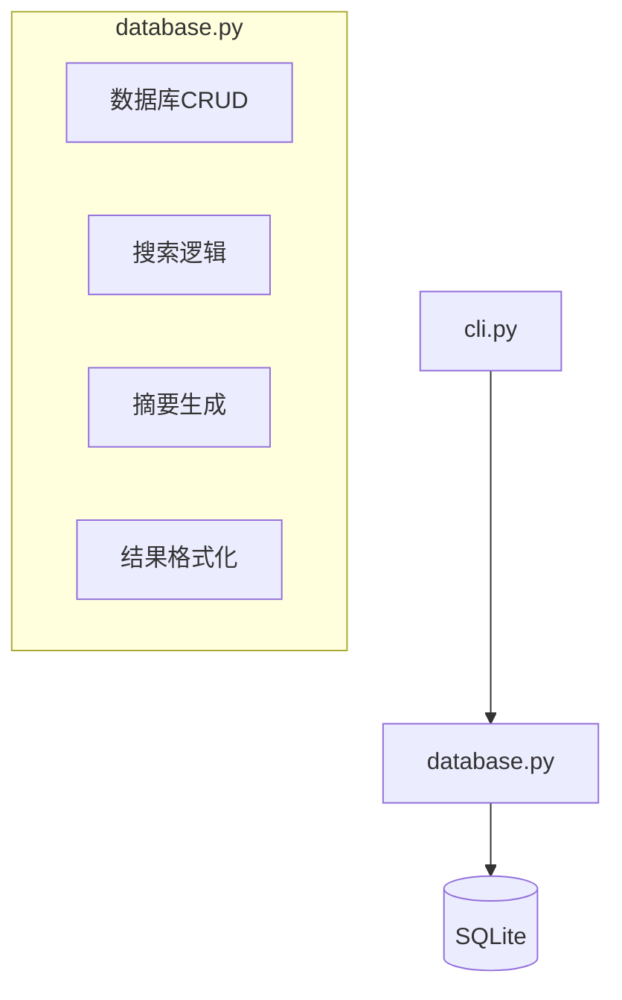
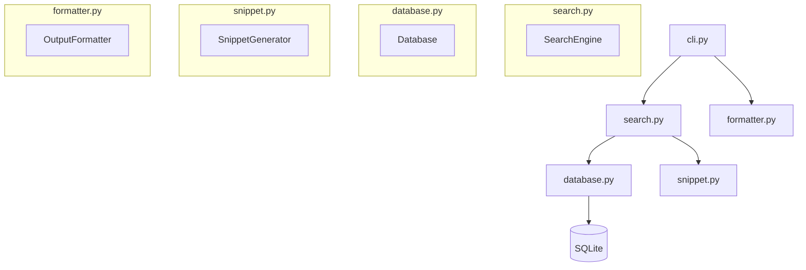
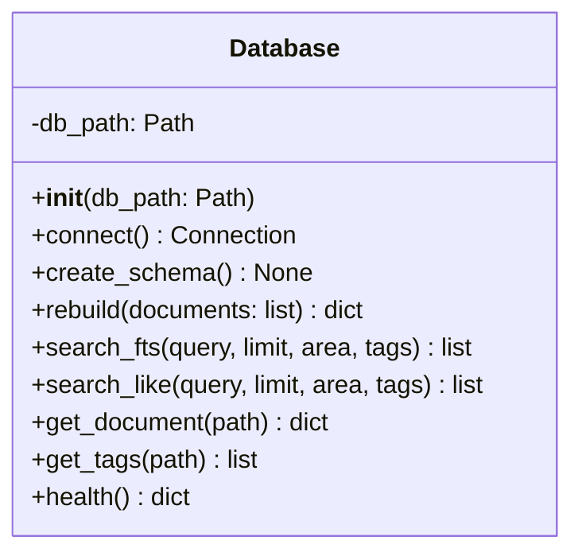
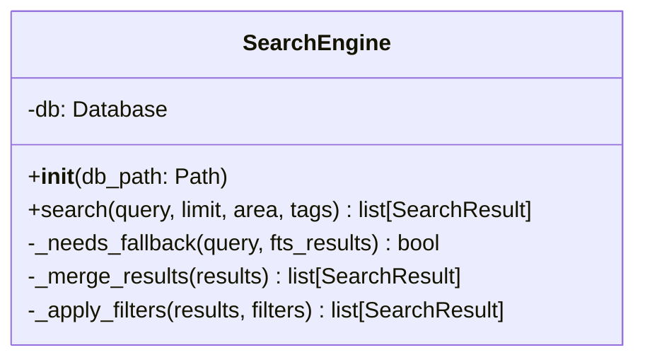
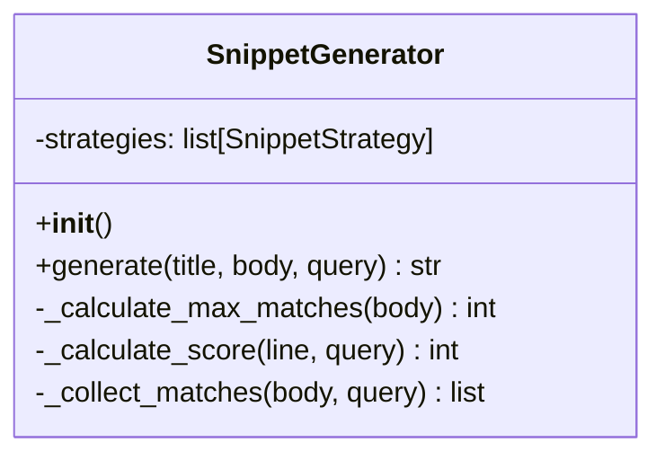
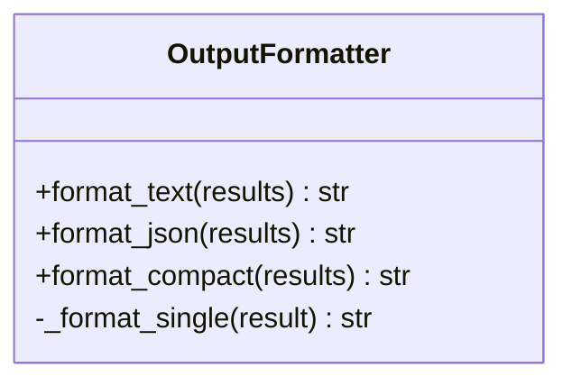
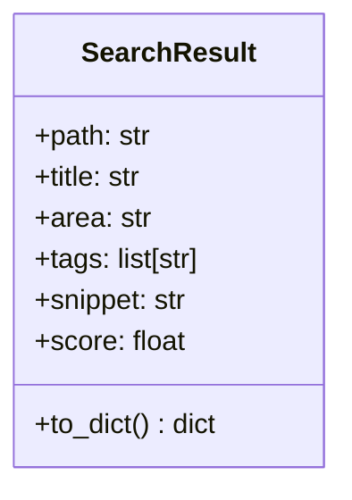
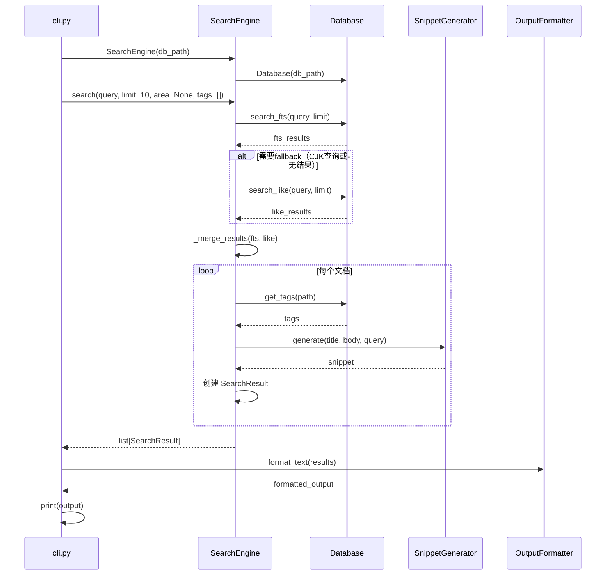
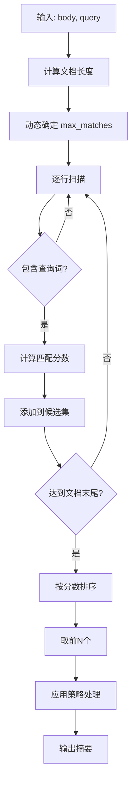
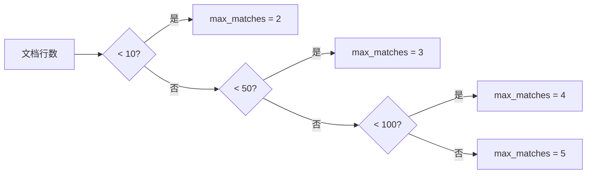

# 查询逻辑重构设计文档

## 1. 现状分析

### 1.1 当前架构



### 1.2 问题识别

| 问题 | 影响 | 严重程度 |
|------|------|----------|
| 职责混杂 | 难以定位和修改 | 高 |
| 可测试性差 | 单元测试困难 | 高 |
| 扩展性受限 | 新增功能影响全局 | 中 |
| 代码复用率低 | 无法单独使用组件 | 中 |

---

## 2. 重构目标

| 目标 | 描述 |
|------|------|
| **单一职责** | 每个模块只负责一件事 |
| **高内聚低耦合** | 模块内部紧密，模块间松散 |
| **可测试性** | 各模块可独立单元测试 |
| **可扩展性** | 易于添加新功能 |
| **代码复用** | 组件可独立复用 |

---

## 3. 重构方案

### 3.1 新架构设计



### 3.2 模块职责划分

| 模块 | 职责 | 核心类/函数 |
|------|------|-------------|
| `database.py` | 纯数据库操作 | `Database` 类 |
| `search.py` | 搜索核心逻辑 | `SearchEngine` 类 |
| `snippet.py` | 智能摘要生成 | `SnippetGenerator` 类 |
| `formatter.py` | CLI输出格式化 | `OutputFormatter` 类 |
| `models.py` | 数据模型定义 | `SearchResult` 数据类 |

### 3.3 类设计

#### 3.3.1 Database 类



#### 3.3.2 SearchEngine 类



#### 3.3.3 SnippetGenerator 类



#### 3.3.4 OutputFormatter 类



#### 3.3.5 SearchResult 数据类



---

## 4. 调用链路



---

## 5. 迁移步骤

### 阶段一：创建新模块

| 步骤 | 操作 | 文件 |
|------|------|------|
| 1 | 创建 `SearchResult` 数据类 | `models.py` |
| 2 | 创建 `Database` 类 | `database.py` |
| 3 | 创建 `SearchEngine` 类 | `search.py` |
| 4 | 创建 `SnippetGenerator` 类 | `snippet.py` |
| 5 | 创建 `OutputFormatter` 类 | `formatter.py` |

### 阶段二：更新调用方

| 步骤 | 操作 | 文件 |
|------|------|------|
| 6 | 更新 CLI 使用新接口 | `cli.py` |
| 7 | 更新测试用例 | `tests/` |

### 阶段三：清理旧代码

| 步骤 | 操作 | 文件 |
|------|------|------|
| 8 | 删除旧函数 | `database.py` |
| 9 | 运行测试验证 | - |

---

## 6. 优化点说明

### 6.1 智能摘要优化



**评分规则**：

| 因素 | 权重 | 说明 |
|------|------|------|
| 标题行 | +30 | 标题中的匹配更重要 |
| 查询词位置 | +0~20 | 越靠前分数越高 |
| 查询词频率 | +15/次 | 出现次数越多越好 |
| 行长度适中 | +10 | 80字符以内加分 |

### 6.2 动态匹配数量



---

## 7. 预期效果

| 指标 | 重构前 | 重构后 |
|------|--------|--------|
| 模块职责数 | 4+ | 1 |
| 单元测试覆盖率 | 低 | 高 |
| 代码复用率 | 低 | 高 |
| 新增功能成本 | 高 | 低 |
| 维护难度 | 高 | 低 |

---

## 8. 风险评估

| 风险 | 等级 | 缓解措施 |
|------|------|----------|
| 引入新bug | 中 | 完整测试覆盖 |
| 性能下降 | 低 | 保持原有算法 |
| API变更 | 中 | 向后兼容设计 |

---

## 9. 代码示例

### 9.1 SearchResult 数据类

```python
from dataclasses import dataclass

@dataclass(frozen=True)
class SearchResult:
    path: str
    title: str
    area: str
    tags: list[str]
    snippet: str
    score: float = 0.0
    
    def to_dict(self) -> dict:
        return {
            "path": self.path,
            "title": self.title,
            "area": self.area,
            "tags": self.tags,
            "snippet": self.snippet,
        }
```

### 9.2 搜索调用示例

```python
# 重构前
results = search_documents(db_path, query, limit=10)

# 重构后
engine = SearchEngine(db_path)
results = engine.search(query, limit=10, area=None, tags=[])
```

---

## 附录：目录结构

```plaintext
src/vault_search/
├── __init__.py
├── cli.py              # CLI入口
├── config.py           # 配置管理
├── database.py         # 数据库操作（重构后）
├── discovery.py        # 文件发现
├── indexer.py          # 索引构建
├── models.py           # 数据模型（新增 SearchResult）
├── parser.py           # Markdown解析
├── search.py           # 搜索引擎（新增）
├── snippet.py          # 摘要生成器（新增）
├── formatter.py        # 输出格式化器（新增）
└── snippet_strategies/ # 策略模式目录
    ├── __init__.py
    ├── base.py
    ├── code_block.py
    ├── table.py
    ├── list.py
    └── plain_text.py
```
