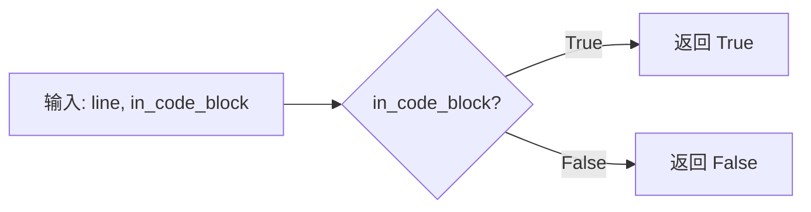
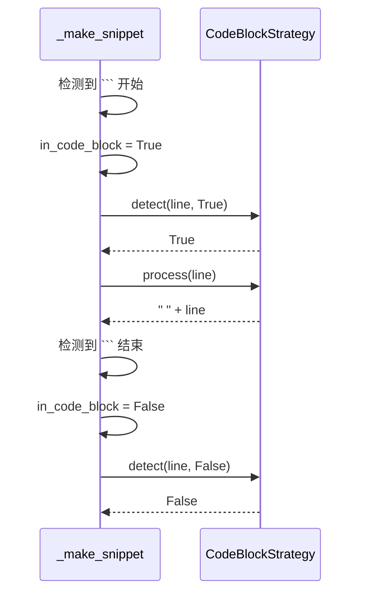

# CodeBlockStrategy 设计文档

## 概述

代码块处理策略，用于处理 Markdown 代码块内容。

## 核心逻辑

### 检测逻辑

**关键特点**：
- 不检查行内容本身
- 完全依赖外部状态 `in_code_block`
- 被动响应代码块边界检测

### 处理逻辑

**效果示例**：

| 输入 | 输出 |
|------|------|
| `def hello():` | `    def hello():` |
| `    print("Hi")` | `        print("Hi")` |

## 与主循环的协作

## 设计原因

| 方案 | 优点 | 缺点 |
|------|------|------|
| 当前方案 | 状态统一管理，逻辑清晰 | 依赖外部状态 |
| 策略内检测 | 独立性强 | 重复代码 |

## 扩展方向

未来可增强的功能：
- 记录代码语言标识
- 根据语言类型应用不同格式
- 支持代码+输出配对识别
