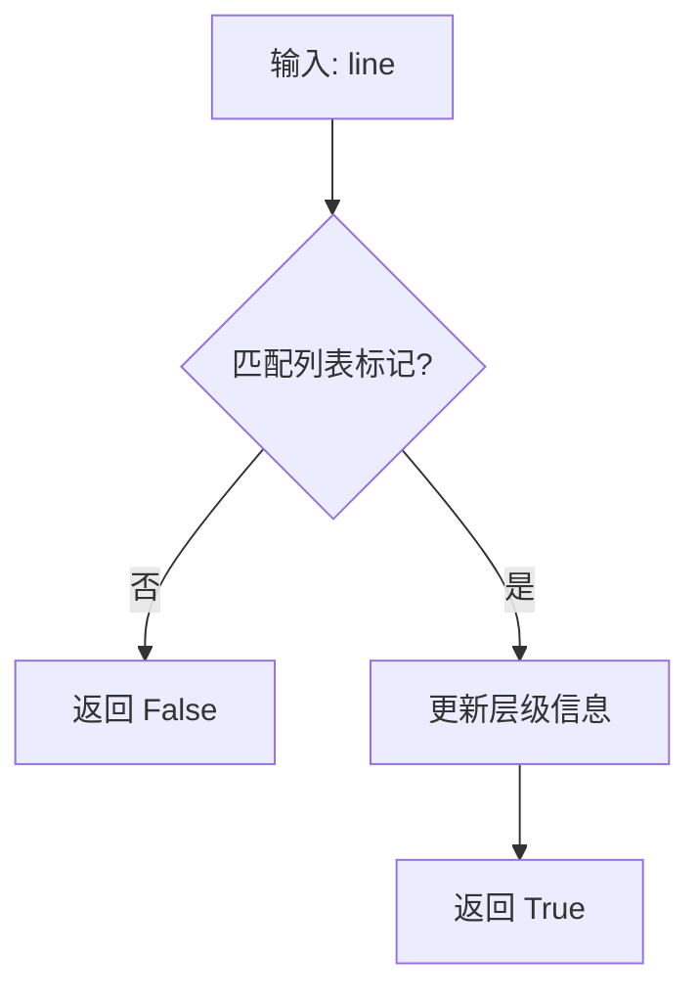
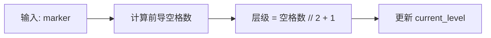
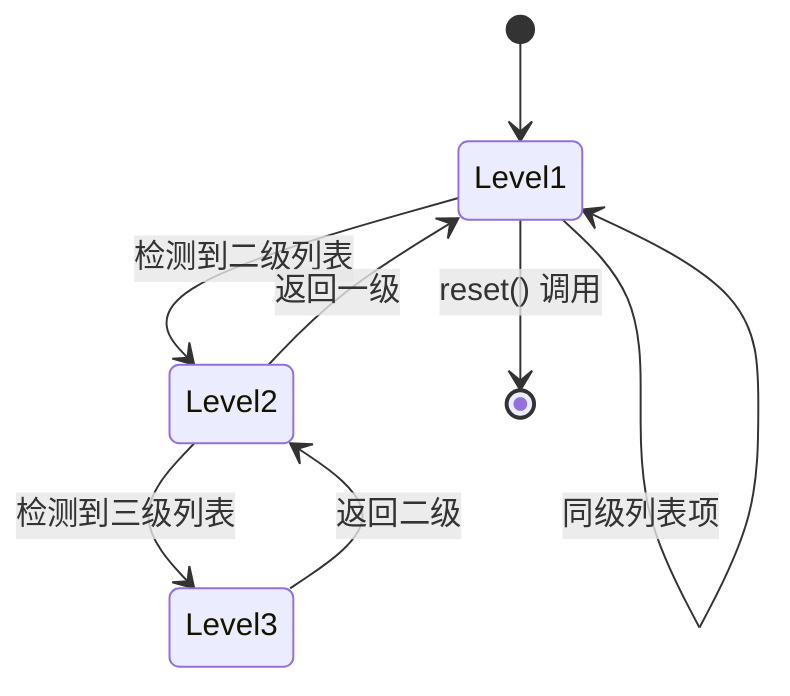
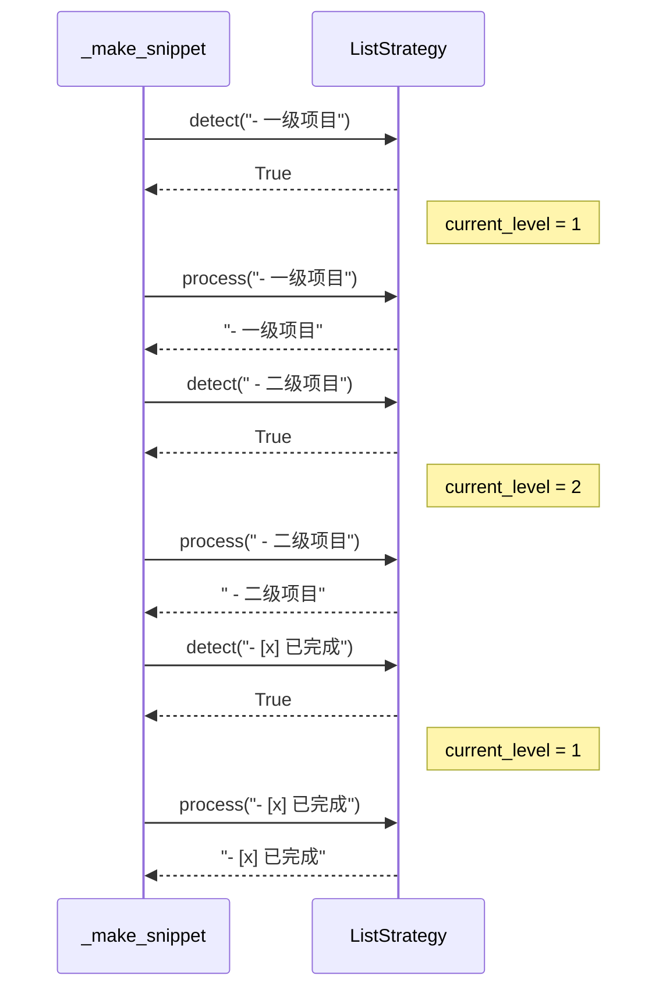

# ListStrategy 设计文档

## 概述

列表处理策略，用于处理 Markdown 列表内容。

## 核心逻辑

### 检测逻辑

**支持的列表类型**：

| 类型 | 标记 | 示例 |
|------|------|------|
| 无序列表 | *, -, + | `- 项目` |
| 有序列表 | 数字. | `1. 第一项` |
| 圆点列表 | • | `• 项目` |
| 复选框 | - [ ] / - [x] | `- [x] 已完成` |

### 层级管理

**层级示例**：

| 标记 | 前导空格 | 层级 |
|------|----------|------|
| `- ` | 0 | 1 |
| `  - ` | 2 | 2 |
| `    - ` | 4 | 3 |

## 状态管理

## 处理流程

## 关键方法

| 方法 | 功能 | 参数 | 返回值 |
|------|------|------|--------|
| `detect()` | 检测列表项 | line, in_code_block | bool |
| `process()` | 处理列表行 | line | str |
| `_update_level()` | 更新层级 | marker | None |
| `is_child_item()` | 判断是否子项 | 无 | bool |
| `reset()` | 重置状态 | 无 | None |
