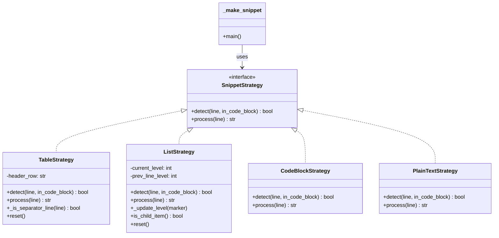
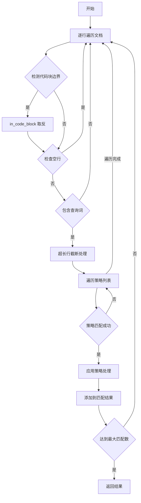

# 策略模式设计文档

## 概述

本文档详细描述了 vault-search 项目中使用的策略模式设计，用于处理不同类型的 Markdown 内容。

## 架构设计

### 策略模式结构图



### 策略执行流程图



## 策略优先级

| 优先级 | 策略              | 检测条件               |
| ------ | ----------------- | ---------------------- |
| 1      | TableStrategy     | 以 \| 开头或包含分隔线 |
| 2      | ListStrategy      | 以列表标记开头         |
| 3      | CodeBlockStrategy | in_code_block=True     |
| 4      | PlainTextStrategy | 始终匹配（兜底）       |

## 目录结构

```plaintext
src/vault_search/snippet_strategies/
├── __init__.py       # 策略注册和导出
├── base.py           # 策略接口定义
├── code_block.py     # 代码块策略
├── table.py          # 表格策略
├── list.py           # 列表策略
└── plain_text.py     # 普通文本策略
```
