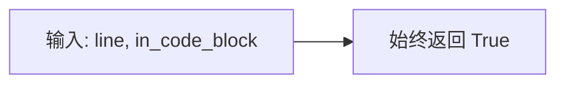
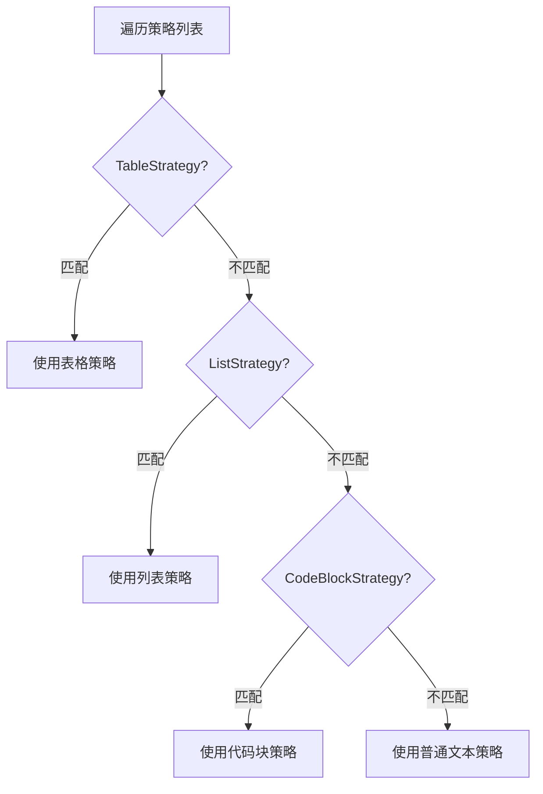
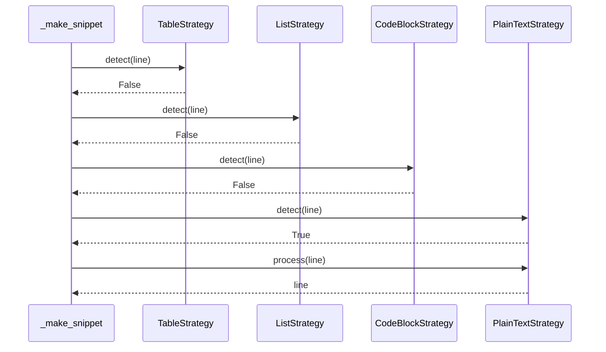

# PlainTextStrategy 设计文档

## 概述

普通文本处理策略，作为兜底策略处理所有未被其他策略匹配的内容。

## 核心逻辑

### 检测逻辑

**设计特点**：
- 始终返回 True
- 必须放在策略列表的最后
- 确保所有内容都能被处理

### 处理逻辑

**效果示例**：

| 输入 | 输出 |
|------|------|
| `这是一段普通文本` | `这是一段普通文本` |
| `## 标题` | `## 标题` |

## 兜底机制

## 设计原因

| 设计原则 | 说明 |
|----------|------|
| 完整性 | 确保所有内容都能被处理 |
| 简单性 | 不做任何修改，保持原样 |
| 安全性 | 作为最后一道防线 |

## 在策略链中的位置

