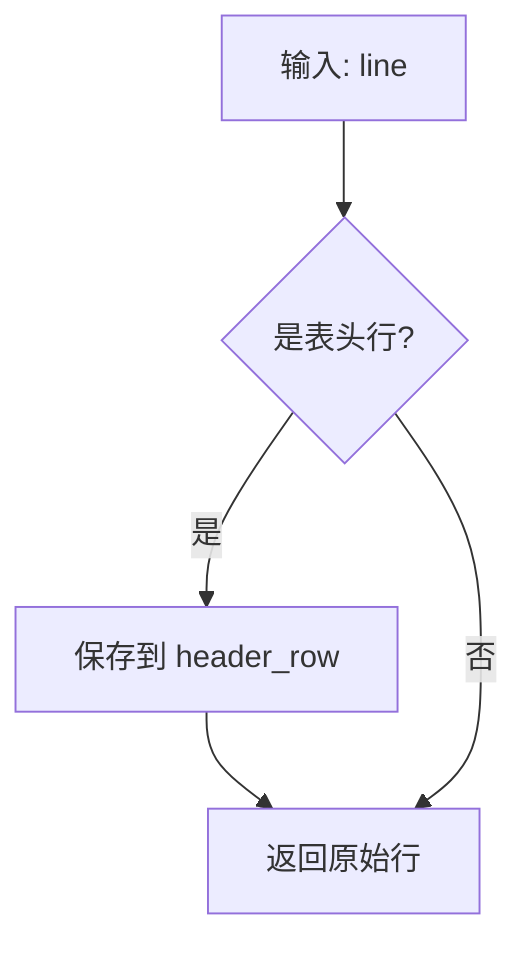
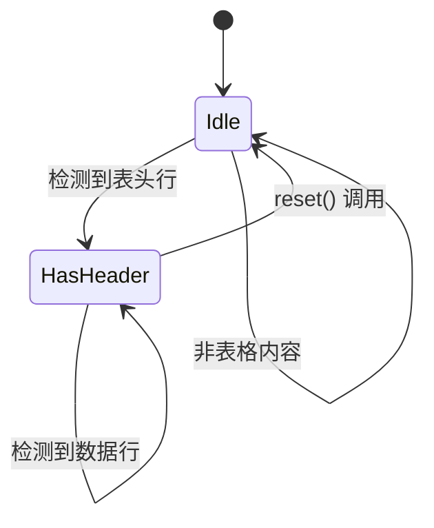
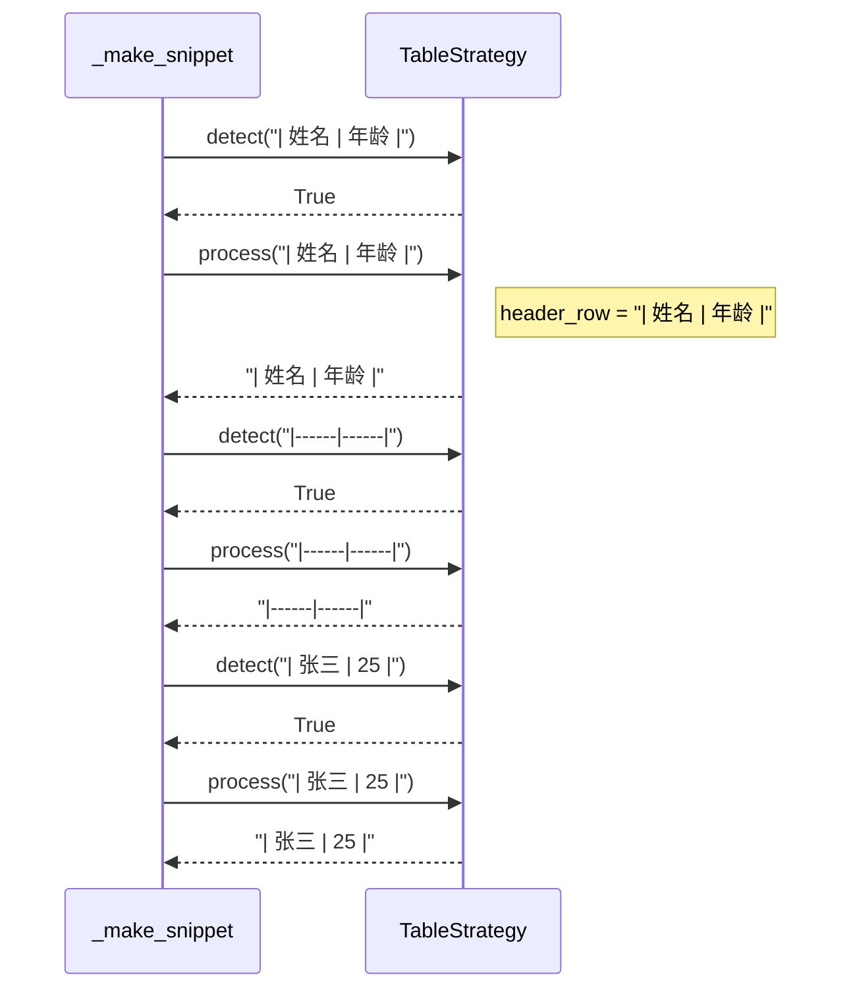

# TableStrategy 设计文档

## 概述

表格处理策略，用于处理 Markdown 表格内容。

## 核心逻辑

### 检测逻辑

```mermaid
flowchart TD
    A[输入: line] --> B{包含 \| ?}
    B -->|否| C[返回 False]
    B -->|是| D{以 \| 开头 或 是分隔线?}
    D -->|是| E[返回 True]
    D -->|否| C
```

**表格类型支持**：

| 类型 | 特征 | 示例 |
|------|------|------|
| 标准表格 | 每行以 \| 开头 | \| 姓名 \| 年龄 \| |
| 分隔线行 | 包含 \| 和 :- | \|------\|------\| |

### 处理逻辑



## 状态管理



## 处理流程



## 关键方法

| 方法 | 功能 | 参数 | 返回值 |
|------|------|------|--------|
| `detect()` | 检测表格行 | line, in_code_block | bool |
| `process()` | 处理表格行 | line | str |
| `_is_separator_line()` | 判断分隔线 | line | bool |
| `reset()` | 重置状态 | 无 | None |
